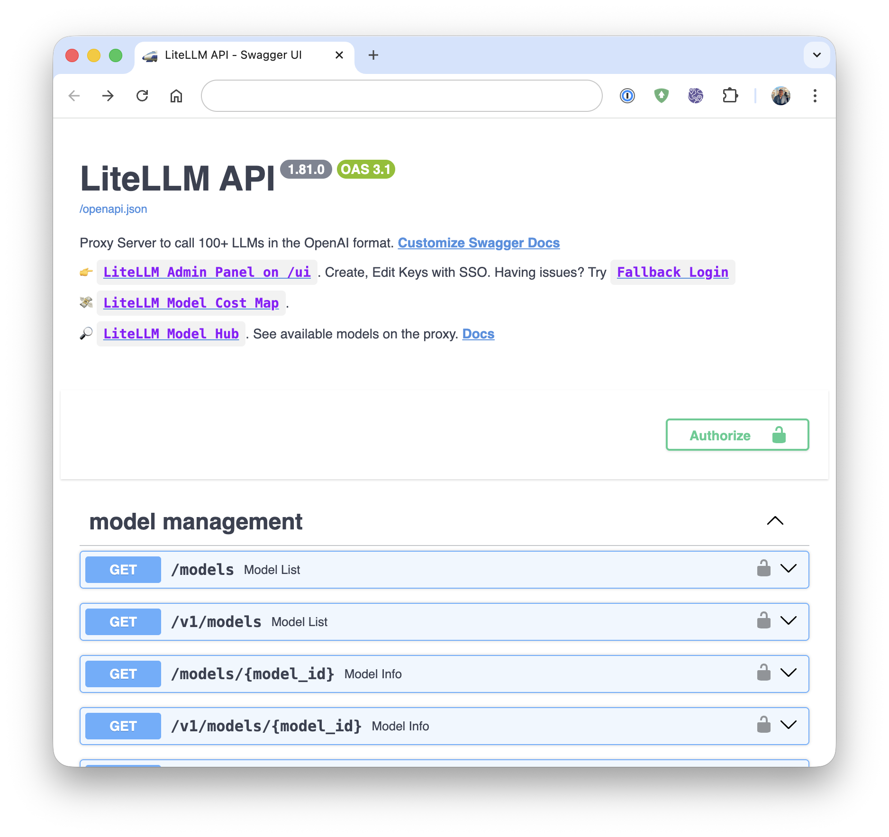
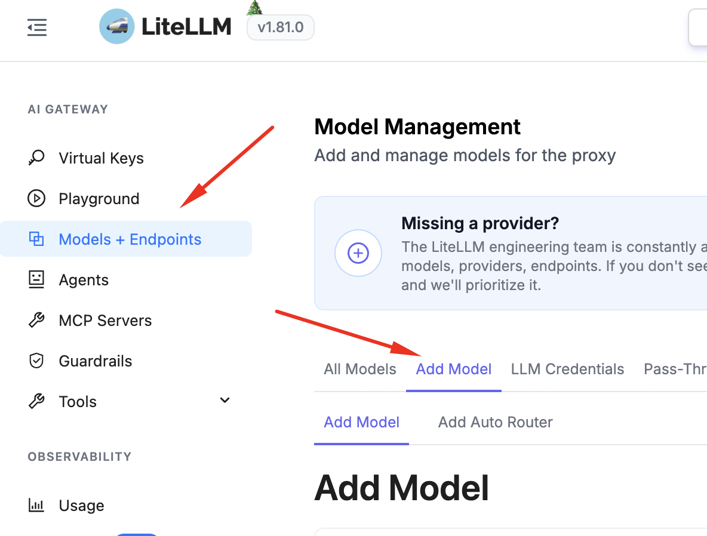
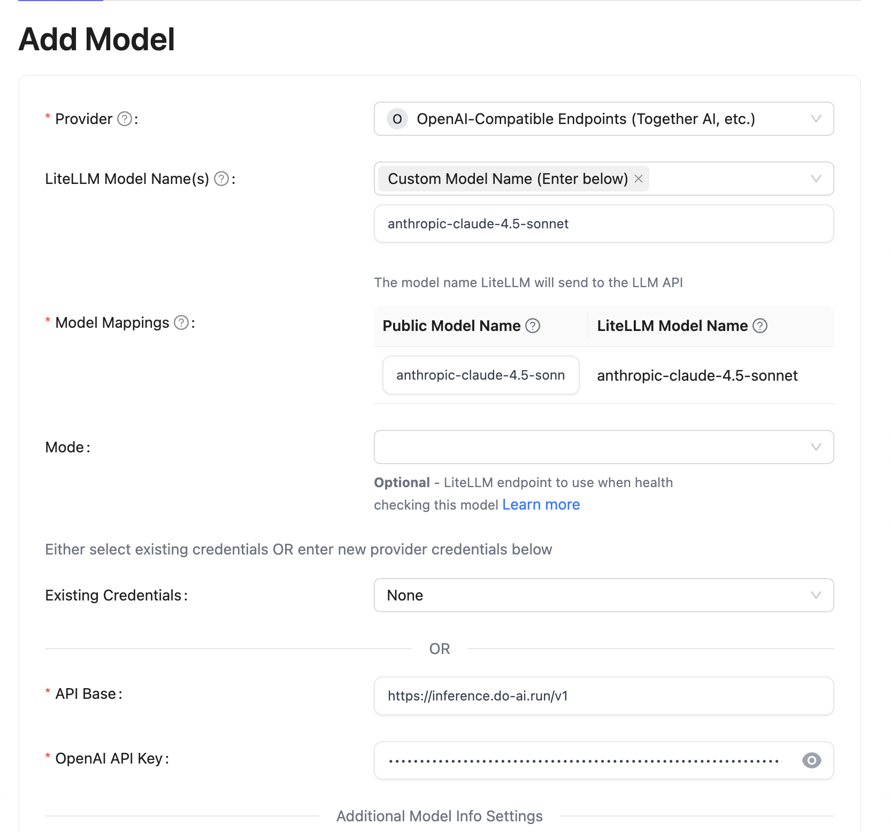

[](https://cloud.digitalocean.com/apps/new?repo=https://github.com/jkpe/litellm/tree/main)

# Use DigitalOcean Serverless inference with Claude Code.

Did you know you can use DigitalOcean Serverless Inference endpoint with Claude Code.

This is because Claude Code supports [third party gateways.] that support the Anthropic API format `/v1/messages` `/v1/messages/count_tokens` (https://code.claude.com/docs/en/llm-gateway)

Using this this setup provides:

- Consolidated billing and usage tracking through your DigitalOcean account.
- Your own self-hosted [LiteLLM](https://www.litellm.ai/) gateway.
  - Proxy Server (AI Gateway) to call 100+ LLM APIs in OpenAI (or native) format, with cost tracking, guardrails, loadbalancing and logging.

# Products used:

- [Claude Code](https://www.anthropic.com/news/claude-code)
- [Litellm](https://github.com/BerriAI/litellm)
- [DigitalOcean Serverless inference](https://docs.digitalocean.com/products/gradient-ai-platform/how-to/use-serverless-inference/)
- [DigitalOcean App Platform](https://docs.digitalocean.com/products/app-platform/)
- [DigitalOcean Database](https://docs.digitalocean.com/products/databases/)

## How does it work?

DigitalOcean's Serverless Inference API Endpoints support support a wide range of [models](https://docs.digitalocean.com/products/gradient-ai-platform/details/models/), including ClaudeSonnet 4.5 and Claude Opus 4.5. However, it only supports the OpenAI API format `/v1/chat/completions` endpoint.

We use Litellm, hosted on DigitalOcean App Platform, to proxy requests from Claude Code to DigitalOcean Serverless Inference API.

## How to deploy the gateway

1. Click the button below to deploy the gateway to DigitalOcean App Platform:

   [](https://cloud.digitalocean.com/apps/new?repo=https://github.com/jkpe/litellm/tree/main)

2. Set the following environment variables, leave the rest as default:

   Use `openssl rand -hex 32` to generate a random master key.

   | Environment Variable   | Description                                                      |
   |-----------------------|------------------------------------------------------------------|
   | `LITELLM_MASTER_KEY`  | Master key for authenticating and protecting your LiteLLM gateway|
   | `UI_USERNAME`         | Username for accessing the LiteLLM web user interface            |
   | `UI_PASSWORD`         | Password for the web UI (keep secret)                            |

3. Once deployed, browse to the app URL and login with the username and password you set. `https://your-app-name.ondigitalocean.app/ui`




4. Add DigitalOcean Serverless Inference API Endpoint to the gateway in the UI. [Here are the steps with screenshots.](https://docs.litellm.ai/docs/proxy/ui_credentials)

- Provider: `OpenAI-Compatible Endpoints`
- LiteLLM Model Name: `Custom Model Name`
- API Base: `https://inference.do-ai.run/v1`
- API Key: Generate it here: [https://cloud.digitalocean.com/gen-ai/model-access-keys](https://cloud.digitalocean.com/gen-ai/model-access-keys).




### Configuring Claude Code to use the gateway

(optional) Generate a Virtual Key for Claude Code to use the gateway.
1. Browse to the LiteLLM web user interface.
2. Click on the "Virtual Keys" tab.
3. Click on "Create New Key"
4. Set the API Key as the `ANTHROPIC_AUTH_TOKEN` environment variable in Claude Code.

You need to set the following environment variables:

```
export ANTHROPIC_BASE_URL=https://your-app-name.ondigitalocean.app
export ANTHROPIC_MODEL=anthropic-claude-4.5-sonnet
export ANTHROPIC_AUTH_TOKEN=sk-litellm-key
export CLAUDE_CODE_DISABLE_EXPERIMENTAL_BETAS=1
```