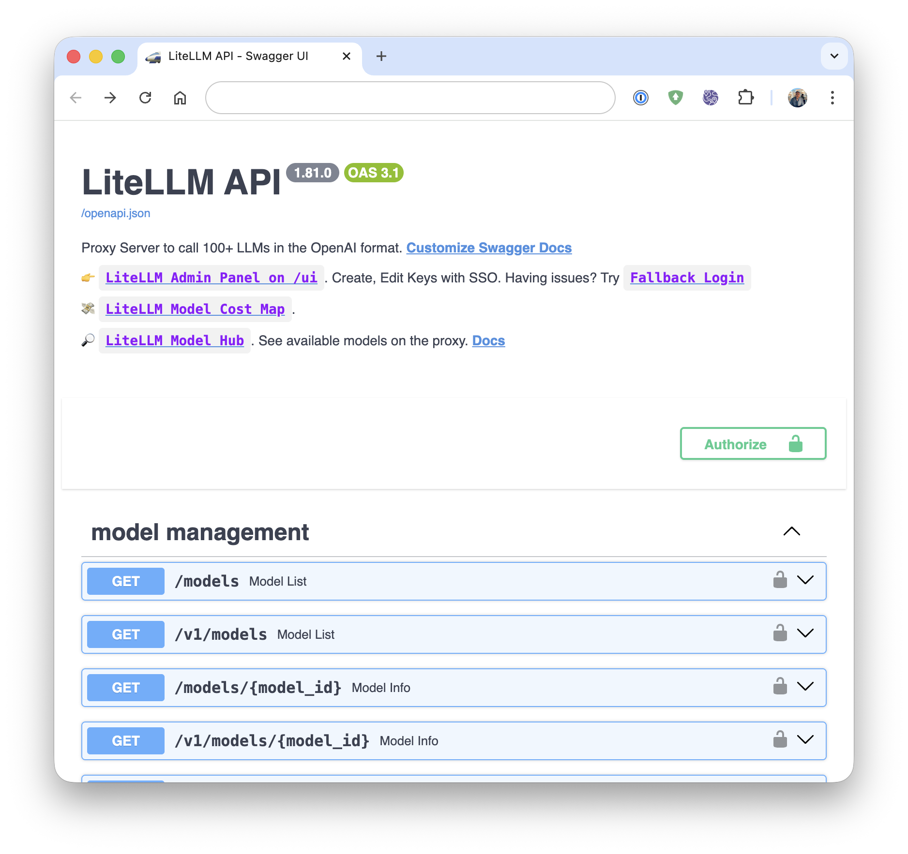
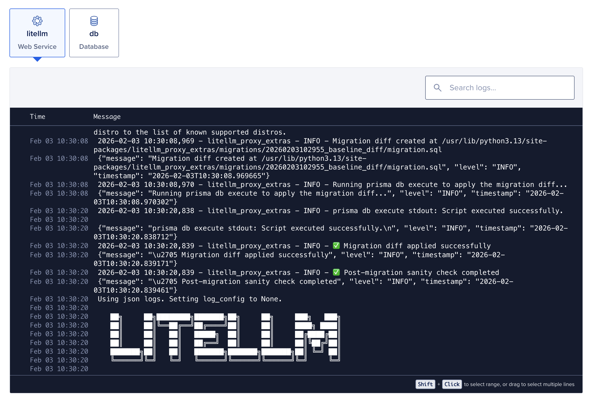
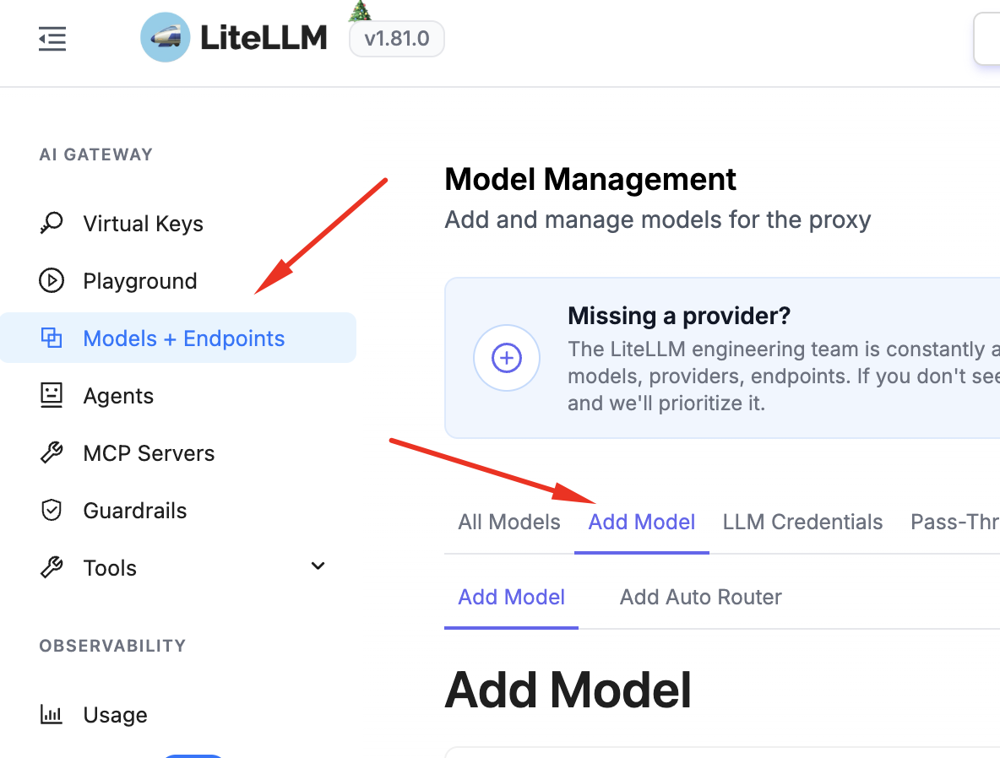
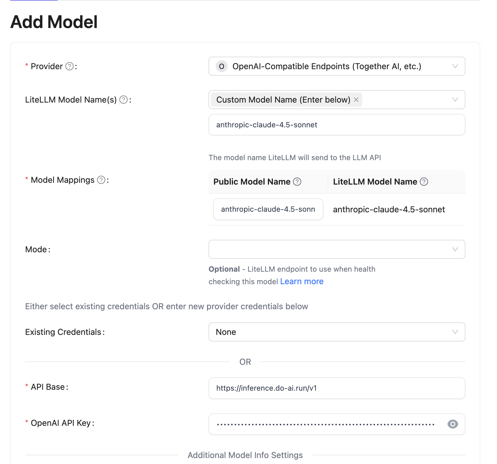

[](https://cloud.digitalocean.com/apps/new?repo=https://github.com/jkpe/claude-code-digitalocean/tree/main)

# Using DigitalOcean Serverless Inference as a Gateway for Claude Code

Did you know you can use DigitalOcean Serverless Inference endpoint with Claude Code?

This is because Claude Code supports [third party gateways](https://code.claude.com/docs/en/llm-gateway). A third party gateway is a server that supports the Anthropic API format `/v1/messages` `/v1/messages/count_tokens`

Using this this setup provides:

- Consolidated billing and usage tracking through your DigitalOcean account.
- Your own self-hosted [LiteLLM](https://www.litellm.ai/) gateway - a proxy server (AI Gateway) to call 100+ LLM APIs in OpenAI (or native) format, with cost tracking, guardrails, loadbalancing and logging.

## How does it work?

DigitalOcean's Serverless Inference API Endpoints support support a wide range of [models](https://docs.digitalocean.com/products/gradient-ai-platform/details/models/), including Claude Sonnet 4.5 and Claude Opus 4.5. However, it only supports the OpenAI API format `/v1/chat/completions` endpoint.

We use Litellm, hosted on DigitalOcean App Platform, to proxy requests from Claude Code to the DigitalOcean Serverless Inference API.

# Products used:

- [Claude Code](https://www.anthropic.com/news/claude-code)
- [Litellm](https://github.com/BerriAI/litellm)
- [DigitalOcean Serverless Inference](https://docs.digitalocean.com/products/gradient-ai-platform/how-to/use-serverless-inference/)
- [DigitalOcean App Platform](https://docs.digitalocean.com/products/app-platform/)
- [DigitalOcean Database](https://docs.digitalocean.com/products/databases/)

## How to deploy the gateway

The one-click deploy builds LiteLLM from this repo’s `Dockerfile.litellm`, which applies the [empty-text-block fix](#fixing-400-bad-request--text-content-blocks-must-be-non-empty), so the gateway is ready for Claude Code without extra steps.

1. Click the button below to deploy the gateway to DigitalOcean App Platform:

   [](https://cloud.digitalocean.com/apps/new?repo=https://github.com/jkpe/claude-code-digitalocean/tree/main)

2. Set the following environment variables, leave the rest as default:

   Use `openssl rand -hex 32` to generate a random master key.

   | Environment Variable   | Description                                                      |
   |-----------------------|------------------------------------------------------------------|
   | `LITELLM_MASTER_KEY`  | Master key for authenticating and protecting your LiteLLM gateway|
   | `UI_USERNAME`         | Username for accessing the LiteLLM web user interface            |
   | `UI_PASSWORD`         | Password for accessing the LiteLLM web user interface                       |

   (optional) Set the `STORE_PROMPTS_IN_SPEND_LOGS` environment variable to `True` to enable storing prompt requests and responses in logs.

3. Once deployed, browse to the app URL and login with the username and password you set. `https://your-app-name.ondigitalocean.app/ui`

4. Add DigitalOcean Serverless Inference API Endpoint to the gateway in the UI. [Here are the steps with screenshots.](https://docs.litellm.ai/docs/proxy/ui_credentials)

- Provider: `OpenAI-Compatible Endpoints`
- LiteLLM Model Name: `anthropic-claude-4.5-sonnet` (this is the model name that is passed to the DigitalOcean Serverless Inference API Endpoint)
- Model Name: `digitalocean-anthropic-claude-4.5-sonnet` (this is the model name that Claude Code will use, set it to whatever you want, it will be used as the `ANTHROPIC_MODEL` environment variable in Claude Code)
- API Base: `https://inference.do-ai.run/v1`
- API Key: Generate it here: [https://cloud.digitalocean.com/gen-ai/model-access-keys](https://cloud.digitalocean.com/gen-ai/model-access-keys).

LiteLLM web user interface:

<a href="./screenshots/litellm-ui.png"></a>

LiteLLM deployed to DigitalOcean App Platform:

<a href="./screenshots/litellm-deployed.png"></a>

Adding the DigitalOcean Serverless Inference API Endpoint to the LiteLLM gateway:

<a href="./screenshots/add-model.png"></a>

LiteLLM with DigitalOcean Serverless Inference API Endpoint added:

<a href="./screenshots/add-do.png"></a>

### Configuring Claude Code to use the gateway

(optional) Generate a Virtual Key for Claude Code to use the gateway, you can also use your master key that we set earlier.

1. Browse to the LiteLLM web user interface.
2. Click on the "Virtual Keys" tab.
3. Click on "Create New Key"
4. Set the API Key as the `ANTHROPIC_AUTH_TOKEN` environment variable in Claude Code.

Set the following environment variables for Claude Code to use the gateway:

```
export ANTHROPIC_BASE_URL=https://your-app-name.ondigitalocean.app
export ANTHROPIC_MODEL=digitalocean-anthropic-claude-4.5-sonnet
export ANTHROPIC_AUTH_TOKEN=sk-litellm-key
export CLAUDE_CODE_DISABLE_EXPERIMENTAL_BETAS=1
```

### Fixing "400 Bad Request – text content blocks must be non-empty"

When using **Anthropic pass-through** (`/v1/messages`), Claude Code sometimes sends message blocks with empty or whitespace-only text. Anthropic rejects these with:

```text
400 Bad Request
messages: text content blocks must be non-empty
```

LiteLLM currently forwards the payload as-is, so you need to sanitize empty blocks before the request reaches Anthropic. This repo includes two options:

#### Option A: Sanitizer callback (recommended if you run LiteLLM from source or a custom entrypoint)

1. Copy `litellm_anthropic_sanitizer.py` into your LiteLLM environment (or mount it where Python can import it).
2. Before starting the LiteLLM server, register the callback:

```python
import litellm
from litellm_anthropic_sanitizer import AnthropicEmptyBlockSanitizer

litellm.add_callback(AnthropicEmptyBlockSanitizer())
# then start the proxy, e.g. litellm (cli) or uvicorn
```

If you use a custom Docker image, add an entrypoint script that does the above then runs the normal LiteLLM command.

#### Option B: Patch LiteLLM’s Anthropic pass-through handler

Apply the included patch so the handler sanitizes messages before forwarding:

```bash
# From the repo root, with LiteLLM source (e.g. in a venv or Docker build)
cd path/to/litellm  # or pip show litellm, then cd to site-packages/litellm
patch -p1 < /path/to/claude-code-digitalocean/patches/litellm-anthropic-empty-blocks.patch
```

Then run or build LiteLLM as usual. **Using the pre-built `berriai/litellm` image:** Build a custom image with the patch applied. From this repo:

```bash
docker build -f Dockerfile.litellm -t your-registry/litellm:patched .
```

Then point your App Platform (or other deployment) at `your-registry/litellm:patched` instead of `berriai/litellm:main-stable`. Alternatively, run LiteLLM from source and apply the patch manually.

The sanitizer removes or replaces empty `{"type":"text","text":""}` blocks so every text block is non-empty (e.g. a single space), which satisfies Anthropic’s API.

**If you deployed from a fork** and want the app to build from your fork (e.g. to pick up your changes), set the litellm service's **Source** in the App Platform dashboard to your GitHub repo and branch instead of the default.

### Testing Claude Code with the gateway

Start Claude Code `claude` and you should see your custom model noted at the top


Send Claude Code a message and you should see the response as usual.


Browse to the LiteLLM web user interface and you should see the request and response in the logs.


